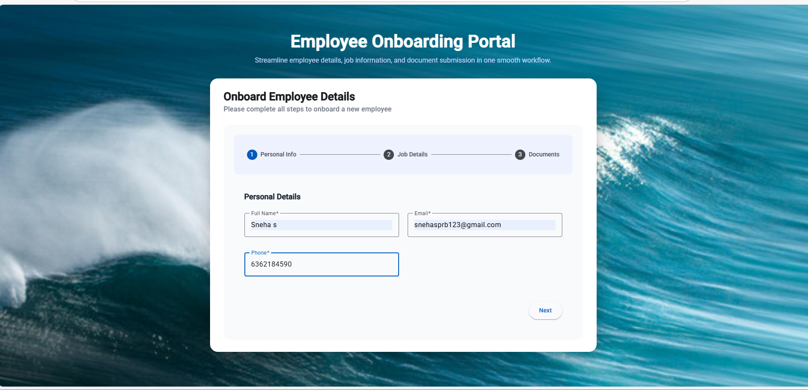
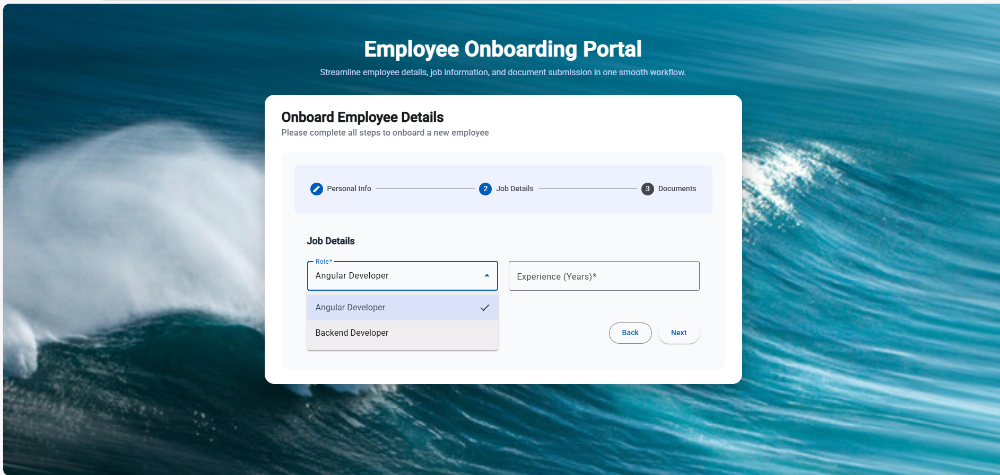
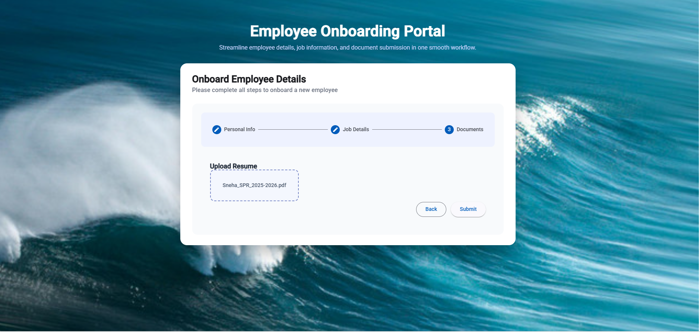
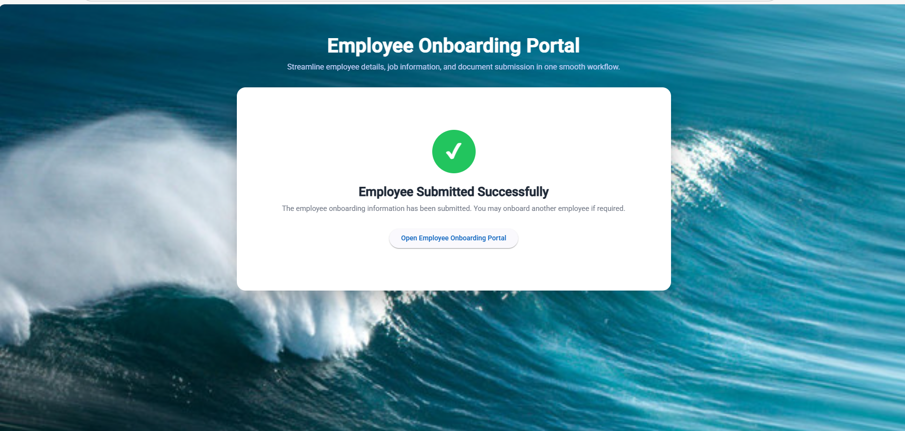

# 🧑‍💼 Employee Onboarding Portal

A modern, responsive **Employee Onboarding Portal** built using **Angular**.  
This application streamlines employee onboarding by collecting personal details, job information, and documents through a step-by-step workflow.

---

## 🚀 Live Demo

🔗 **Live URL:**  
https://sneharudresh.github.io/angular-employee-onboarding-stepper-forms/

---

## ✨ Features

- Multi-step onboarding form (Stepper UI)
- Clean and modern user interface
- Responsive design
- Personal Details, Job Details & Documents flow
- Submission success confirmation screen
- Built using Angular best practices

---

## 🛠️ Tech Stack

- **Angular**
- **TypeScript**
- **HTML5**
- **CSS3**
- **Angular Material**

---

## 📸 Screenshots

### Personal Information Step


### Job Details Step


### Documents Upload Step


### Submission Success


---

## 📦 Installation & Setup

```bash
git clone https://github.com/sneharudresh/angular-employee-onboarding-stepper-forms.git
cd employee-onboarding-form
npm install
ng serve
